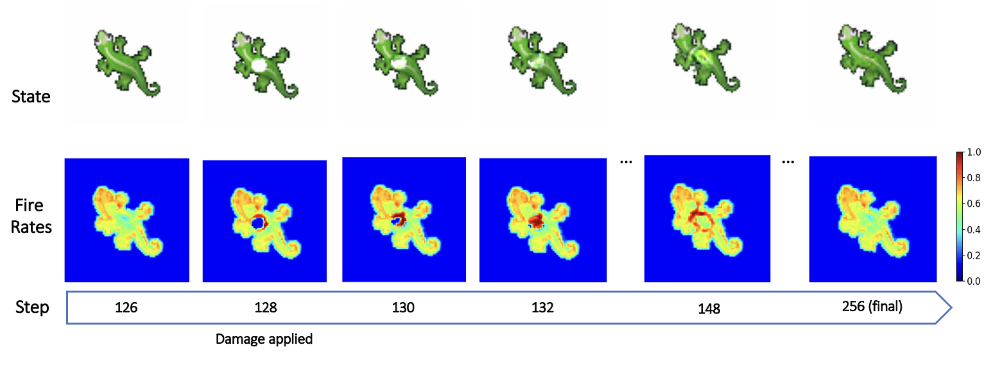
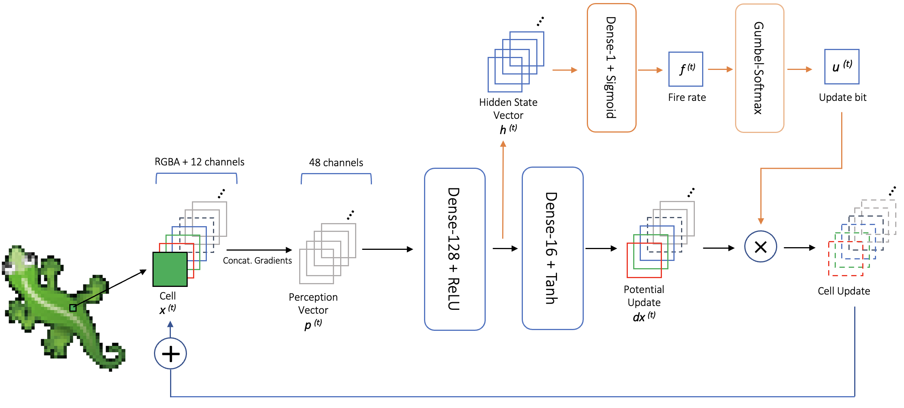

# Adaptive-Neural-Cellular-Automata
 
Repo for the Adaptive-Energy Neural Cellular Automata (AdaptNCA).

**Abstract**: Multicellular organisms grow, maintain and regenerate their bodies in a self-organizing manner, through local interactions with neighboring cells and the environment. The recently developed Neural Cellular Automata (NCA) model has shown that this process can be simulated by using a Neural Network to learn local rules that grow a desired pattern. In NCA, each cell has the same constant probability of being updated (fire rate) at every time step. In this paper, we present Adaptive-Energy Neural Cellular Automata model (AdaptNCA) that addresses some limitations of regular NCA. The main change is a cell-wise fire rate, determined by an additional neuron in the network. The fire rates at each step are interpreted as the square root of the cell's energy expenditure, and the model is trained to minimize the total energy expenditure during growth. We show that AdaptNCA can have better persistence and damage regeneration capabilities than an equivalent NCA model, reaching reconstruction losses up to 46% and 69% lower, respectively.

  
   
  Regeneration of center region damage of AdaptNCA

## Requirements

This project was mainly built in PyTorch. The other Python libraries required to run and train AdaptNCA are specified in `requirements.txt`.

## Models

The models' implementations and auxiliary functions are implemented in `lib/`. `lib/EnergyCAModel.py` is the implementation of Adaptive-Energy NCA, and `lib/CAModel.py`is the implementation of regular NCA, with some improvements (added tanh activation and gradient clipping).

  
   
  AdaptNCA model architecture. The hidden state vector is passed through an additional neuron to compute the cell's fire rate. An update bit is sampled from the fire rate using a Gumbel-Softmax distribution, and it determines if the cell will update. In the main network, a $tanh$ activation was added to the Dense-16 layer to bound the update vector.

## Training

`train[model_name].py` are the files used to train each of the different models. Inside, several global and training parameters can be changed.

## Acknowledgements

This implementation was based of the original Growing NCA paper, and built upon the Growing NCA PyTorch implementation: https://github.com/chenmingxiang110/Growing-Neural-Cellular-Automata.git
